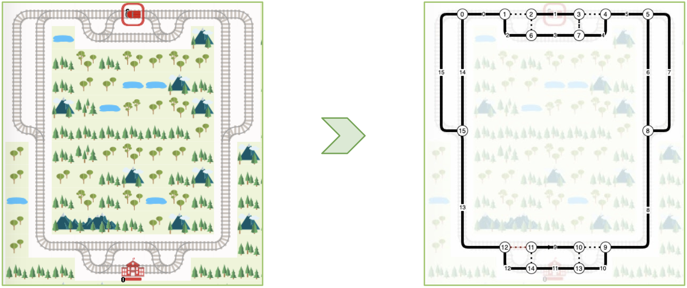
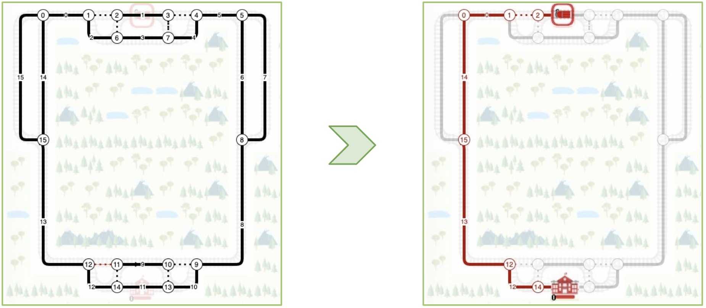
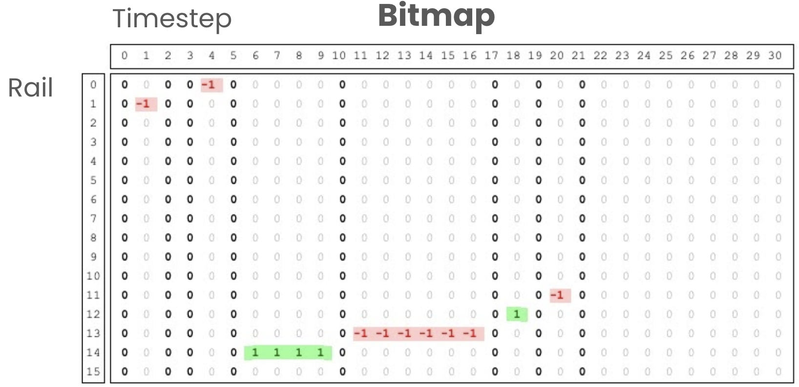
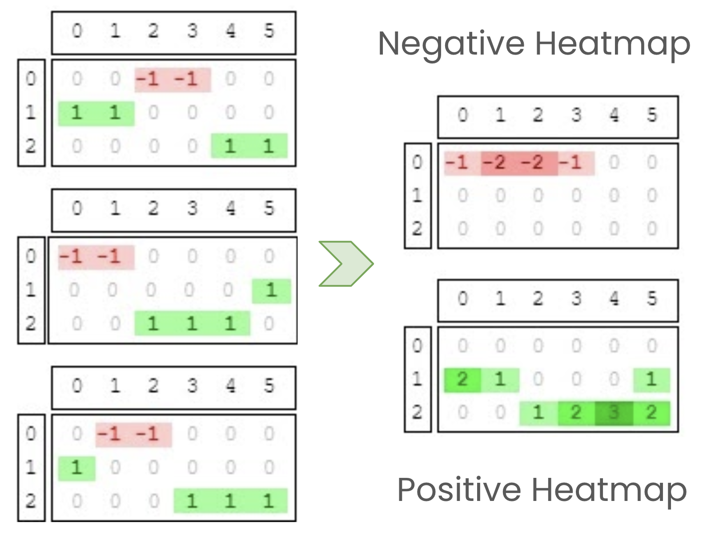
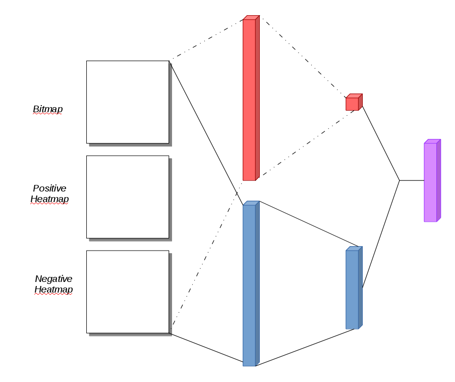

# Solution to the Flatland Challenge
2019 Edition - https://www.aicrowd.com/challenges/flatland-challenge

# Usage
### Train
```bash
python src/main.py --train --num-episodes=10000 --prediction-depth=150 --eps=0.9998 --checkpoint-interval=100 --buffer-size=10000
```

### Using tensorboard
```bash
tensorboard --logdir=runs
```

### Parameters
#### Rendering
```bash
python src/main.py --render
```
### Plotting
```bash
python src/main.py --plot
```

# Docs

## Observations
Observations are obtained by concatenating the _"rail occupancy bitmap"_ of an agent with the _"heatmaps"_.

### Rail occupancy bitmaps
A _"rail occupancy bitmap"_ shows on which rail and in which direction the agent is traveling at every timestep and is obtained as follows:

1. A directed graph representation of the railway network is generated trough BFS, each node is a switch and each edge is a rail between two switches:

    

2. The shortest path for each agent is computed

    

3. The path is then transformed into a bitmap with the timesteps as columns and the rails as rows.

    The direction can be positive (1) if the agent is traveling the edge from the source node to the destination node or negative otherwise (-1), 

    

## Heatmaps
Heatmaps are used to provide informations about how the traffic is distributed across the rails over time.

Each agent computes 2 heatmaps, one positive and one negative, both are generated summing the bitmaps of all the other agents.



## Network
The architecture used is a Dueling DQN, where the input is a Conv2D layer that processes a concatenation of the agent bitmap, 
the positive and the negative heatmaps.
Then data goes through two separate streams, the value (red) and the advantage (blue) 
to be recombined in the final output Q values (purple).



## Training 
The training algorithm follows a Double Q Learning with Random Replay Buffer 
where the action space is reduced to 2 actions (stop and go) and the agent choices are based on
a number of alternative paths that can be generated at every bifurcation point. At every fork the most
promising path is chosen.


For more detailed information on the approaches see:

* Devid Farinelli, [_Apprendimento con rinforzo applicato allo scheduling dei treni per la Flatland challenge_](https://amslaurea.unibo.it/20487/1/farinelli_devid_tesi.pdf) (Italian only)
* Giulia Cantini, [_FLATLAND: A study of Deep Reinforcement Learning methods applied to the vehicle rescheduling problem in a railway environment_](https://amslaurea.unibo.it/20412/1/thesis_giulia_cantini.pdf)
